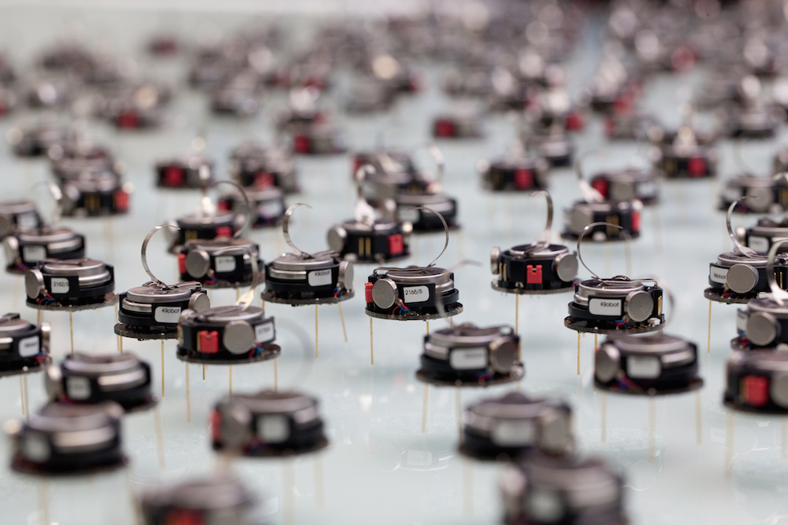
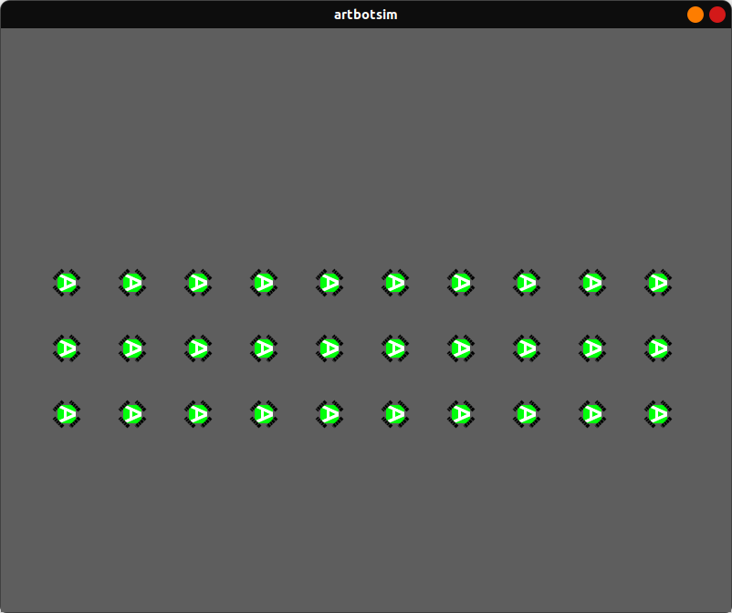

# ARTBot

[](https://github.com/IEEE-NITK/ARTBot/issues)
[](https://github.com/IEEE-NITK/ARTBot/blob/main/LICENSE)


<br>
<details>
  <summary>Table of Contents</summary>
    <ol>
        <li>
            <a href="#introduction">Introduction</a>
            <ul>
                <li><a href="#technologies-used">Technologies Used</a></li>
            </ul>
        </li>
        <li>
            <a href="#literature-survey">Literature Survey</a>
            <ul>
                <li><a href="#robot-operating-system-2">Robot Operating System 2</a></li>
                <li><a href="#basic-terminologies-in-ros-2">Basic Terminologies in ROS 2</a></li>
                <li><a href="#python-programming-language">Python Programming Language</a></li>
                <li><a href="#swarm-robotics">Swarm Robotics</a></li>
            </ul>
        </li>
        <li>
            <a href="#getting-started">Getting Started</a>
            <ul>
            <li><a href="#prerequisites">Prerequisites</a></li>
            <li><a href="#installation">Installation</a></li>
            </ul>
        </li>
        <li>
            <a href="#user-guide">User Guide</a>
                <ul>
                    <li><a href="#launching-artbot-simulation">Launching ARTBot Simulation</a></li>
                </ul>    
        </li>
        <li>
            <a href="#references">References</a> 
        </li>
        <li>
            <a href="#project-mentors">Project Mentors</a></li>
        </li>
        <li>
            <a href="#project-members">Project Members</a></li>
        </li> 
        <li>
            <a href="#license">License</a></li>
        </li>    
    </ol>
</details>

<hr>

## Introduction

<b>Swarm robotics</b>, inspired by the collective behavior of social organisms, offers a unique avenue for creating dynamic and interactive art installations. 


<br>
*Swarm of Robots*

This project seeks to develop an application of swarm robotics by creating a swarm of robots that can autonomously arrange themselves to replicate drawings made by a user. The proposed system leverages swarm intelligence to translate artistic expressions into a visually stunning and collaborative robotic display.

### Technologies Used
[](https://skills.thijs.gg)

## Literature Survey

### Robot Operating System 2

ROS 2 (Robot Operating System 2) is the next-generation open-source robotics middleware framework that builds upon the success of the original ROS. It introduces significant improvements, including support for multiple programming languages, a more robust communication layer based on the Data Distribution Service (DDS) standard, enhanced real-time performance, built-in security features, better support for multi-robot systems and distributed systems, Quality of Service (QoS) policies for reliable communication, improved lifecycle management for nodes, and increased interoperability with other robotics frameworks. ROS 2 also introduces a new Robot Description Format (RDF) for describing robot models and provides tools for maintaining backward compatibility with existing ROS packages, enabling a smoother transition for developers.

### Basic Terminologies in ROS 2:

* Nodes: A node is an executable that uses ROS 2 to communicate with other nodes. A ROS 2 Node can be a Publisher or a Subscriber. A Publisher puts the messages of a standard message type to a particular topic. The Subscriber, on the other hand, subscribes to the topic and receives the messages that are published to the topic.
* Messages: ROS 2 data type used upon subscribing or publishing to a topic.
* Topics: Nodes can publish messages to a topic as well as subscribe to a topic to receive messages.

Client libraries needed for this project: 
* rclpy: Python client library 
* rclcpp: C++ client library

### Python Programming Language
Python is a high-level, general-purpose programming language. Its design philosophy emphasizes code readability with the use of significant indentation. It supports multiple programming paradigms, including structured, object-oriented, and functional programming.

### Swarm Robotics
Swarm robotics is an approach to coordinate multiple robots as a single system to achieve a particular goal. It is inspired by the emergent behavior observed in social insects.

## Getting Started

### Prerequisites

* Ubuntu 22.04
* ROS 2 Iron
> For installing ROS 2 refer to [ROS 2 Wiki](https://docs.ros.org/en/iron/Installation.html)

### Installation

Create a colcon workspace

```bash
mkdir ros_ws
cd ros_ws
mkdir src
colcon build
```
To automatically source this workspace every time a new shell is launched, run these commands

```bash
echo "source <path-to-workspace>/install/setup.bash" >> ~/.bashrc
source ~/.bashrc
```

Clone the repository in the `src` folder in the catkin workspace.

```bash
cd ~/ros_ws/src
git clone https://github.com/IEEE-NITK/ARTBot
```

Navigate back to the workspace folder and build the packages.

```bash
cd ~/ros_ws
colcon build
```

## User Guide

### Launching ARTBot Simulation

To launch the ARTBot simulation use the command

```bash
ros2 launch artbotsim artbotsim.launch.py
```


<br>
*ARTBot Simulation*

To move each of the robot around, we will use teleop_twist_keyboard which is a package for moving the robot using the keyboard: 

```bash
ros2 run teleop_twist_keyboard teleop_twist_keyboard --ros-args --remap cmd_vel:=/<bot_name>/cmd_vel
```

## References

1. [ROS 2 Wiki](https://docs.ros.org/en/iron/index.html)

## Project Mentors:

1. [Joel Jojo Painuthara](https://github.com/JoelJojoP)
2. [Rohan Bahri](https://github.com/rohanbahri)

## Project Members:

1. [Nallagatla Prudhvi](https://github.com/PrudhviNallagatla)
2. [Nishchay Pallav](https://github.com/Captaincool2017)
3. [Kovidh Singh](https://github.com/KoviSingh)

## License:

This repository is licensed under the [BSD-3-Clause License](https://github.com/IEEE-NITK/ARTBot/blob/main/LICENSE)